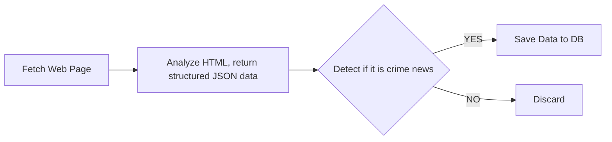

# The Crime Watch Network

The Crime Watch Network is a tool that will scrape online newspapers and extract data to find crime reports. It will then save the metrics to a database for monitoring area-based crime rates.

## Tech Stacks

As I am proficient in the `NodeJS` tech stack, I will build it on the `NodeJS` ecosystem. I chose Microservice Architecture for this.

## Why Microservice?

Until now, I have written many monolithic full-stack apps for clients and as a hobby. To level up my skills, I want to gain experience in microservice architecture. I think this project is ideal yet small enough for a microservice, allowing me to focus on learning more rather than solving complexity.

## How Did I Break the Services into Separate Microservices?

Initially, I planned this as a standard monolithic application. The original flow looked like this:

As I observed, NodeJS can handle many URLs asynchronously, which makes it fast for fetching web pages. However, if we look at processing the web page (e.g., parsing HTML or running CPU-intensive LLM/NLP tasks), it is not fast enough. It will definitely create a bottleneck here. Thus, I decided to break it into separate microservices with some rules in mind.

1. Each service must have a single, distinct responsibility.
2. Services must communicate asynchronously to avoid blocking.
3. Each service must be independently scalable (e.g., I can run 5 Analyzers for every 1 Scraper).
4. Each service must be independently deployable.

Based on these rules, I broke the project down into the following services:

### Services

1. The Field Agents (The Scraper Service)
2. The Lead Detectives (The Analyzer Service)
3. The HQ (Saving data in DB and Public Facing API)
4. The Dispatch Radio (RabbitMQ): The message broker that holds the raw data in a queue, ensuring no scraped articles are lost while waiting to be analyzed.